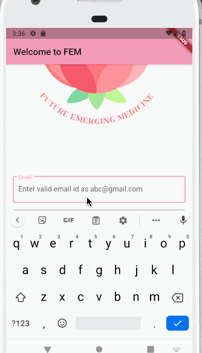

# FEM app

A Flutter project aimed towards providing women the resources they need for a high quality of life.
Created by Libanose Teffera, Annie Chang, Elizabeth Hoang, and Jennifer Pham for Athena Hacks 2021.

## Technologies

This project uses Flutter, Google Cloud, and was coded using Visual Studio Basic.

## Sample Run

 
